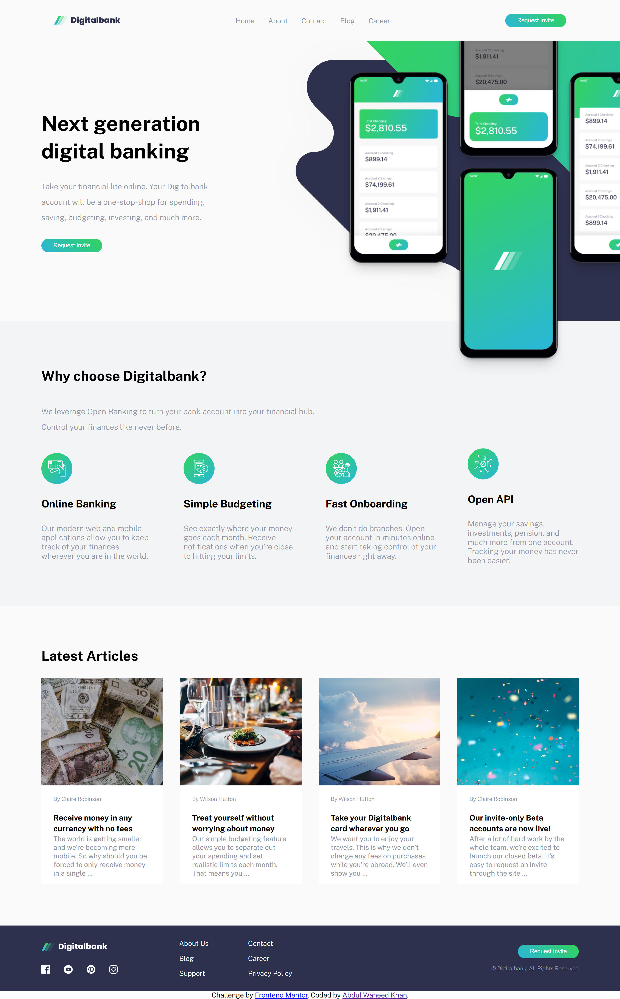
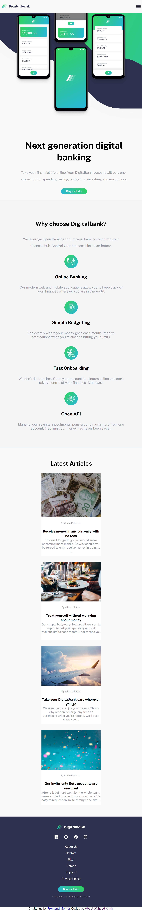

Digitalbank Landing Page

A modern, responsive landing page for a digital banking platform.
Built with semantic HTML, CSS Grid/Flexbox, and design tokens, following best frontend practices.

🔗 Live Demo:
👉 https://waheedkhan10001.github.io/digitalbank-landing-page/

## 📸 Screenshots

### Desktop View (1440px)

### Mobile View (768px)

🚀 Features

Fully responsive layout (desktop → mobile)

CSS Grid & Flexbox based layout system

Design tokens using CSS variables

Accessible navigation and buttons

Pixel-aligned hero section with layered backgrounds

Clean, scalable folder structure

Frontend Mentor challenge–compliant

🛠️ Built With

HTML5 – semantic markup

CSS3

CSS Grid

Flexbox

Custom properties (design tokens)

Google Fonts (Public Sans)

📂 Project Structure
digitalbank-landing-page/
│
├── index.html
├── style.css
├── token.css
├── images/
│ ├── logo-dark.svg
│ ├── logo-light.svg
│ ├── image-mockups.png
│ ├── bg-intro-desktop.svg
│ ├── bg-intro-mobile.svg
│ └── icons & article images
│
├── screenshots/
│ ├── desktop.png
│ └── mobile.png
│
├── LICENSE
└── README.md

## 📄 License

This project is licensed under the MIT License.  
See the license file here: [LICENSE](./LICENSE)

🙌 Acknowledgements

Challenge by Frontend Mentor

Design inspired by official challenge assets

Coded by Abdul Waheed Khan

📌 Notes for Reviewers

No frameworks or libraries used

Focused on layout accuracy, responsiveness, and clean CSS architecture

Ideal as a junior frontend portfolio project
